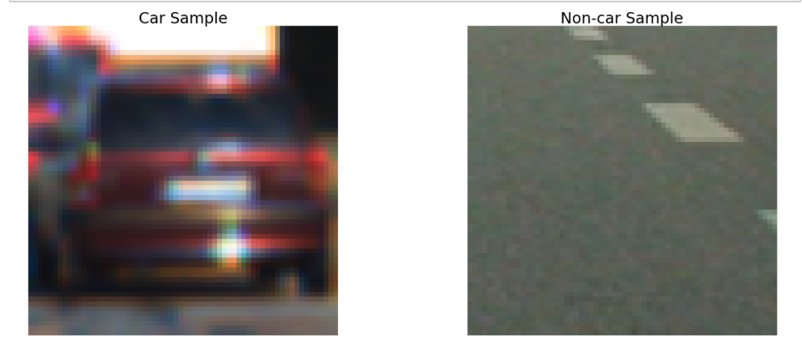
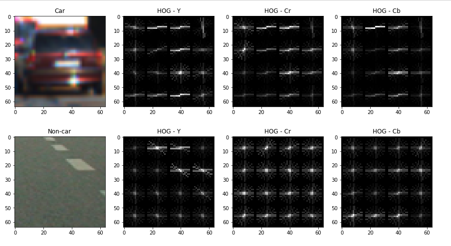
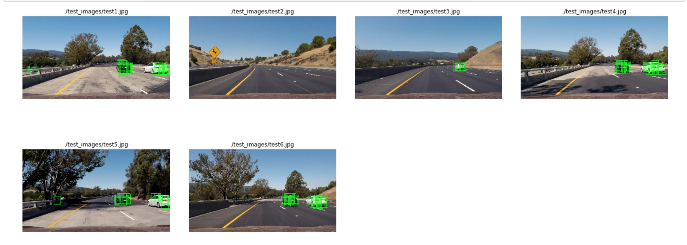
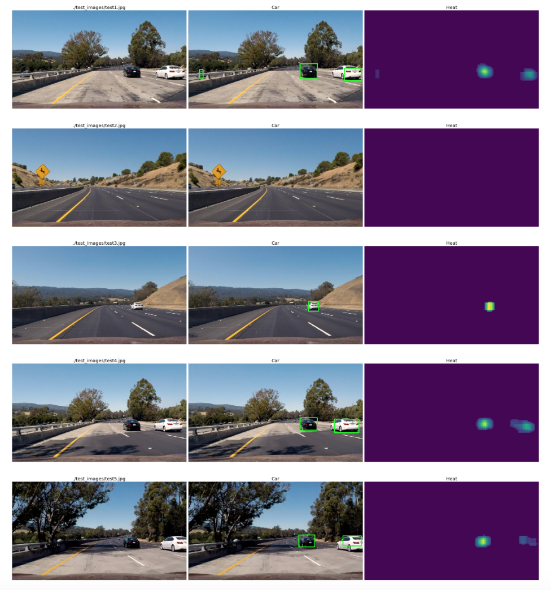

# Vehicle Detection Project
---

## Goal

The goals / steps of this project are the following:

* Perform a **Histogram of Oriented Gradients (HOG)** feature extraction on a labeled training set of images and train a classifier **Linear SVM classifier**
* Optionally, you can also apply a color transform and append binned color features, as well as histograms of color, to your HOG feature vector. 
* Note: for those first two steps don't forget to normalize your features and randomize a selection for training and testing.
* Implement a sliding-window technique and use your trained classifier to search for vehicles in images.
* Run your pipeline on a video stream (start with the test_video.mp4 and later implement on full project_video.mp4) and create a heat map of recurring detections frame by frame to reject outliers and follow detected vehicles.
* Estimate a bounding box for vehicles detected.


## [Rubric](https://review.udacity.com/#!/rubrics/513/view) Points
### Here I will consider the rubric points individually and describe how I addressed each point in my implementation.  

---
### Writeup / README

####1. Provide a Writeup / README that includes all the rubric points and how you addressed each one.  You can submit your writeup as markdown or pdf.  [Here](https://github.com/udacity/CarND-Vehicle-Detection/blob/master/writeup_template.md) is a template writeup for this project you can use as a guide and a starting point.  

You're reading it!

### Histogram of Oriented Gradients (HOG)

#### 1. Explain how (and identify where in your code) you extracted HOG features from the training images.

The code for this step is contained in the 1 ~ 10 code cells of the `vehicle-detection.ipynb`.  

I started by reading in all the `vehicle` and `non-vehicle` images.  The training data has 8792 sampels, and 8968 Non-vehicles. Here is an example of one of each of the `vehicle` and `non-vehicle` classes:



I then explored different color spaces and different `skimage.hog()` parameters (`orientations`, `pixels_per_cell`, and `cells_per_block`).  I grabbed random images from each of the two classes and displayed them to get a feel for what the `skimage.hog()` output looks like.

Here is an example using the `YCrCb` color space and HOG parameters of `orientations=11`, `pixels_per_cell=(16, 16)` and `cells_per_block=(2, 2)`:





#### 2. Explain how you settled on your final choice of HOG parameters.

Besides HOG, I also include spatial and color histogram 
as features to train SVM. I use class `feature_params` and store all the parameters and the function `extract_features` (calling other functions) to get all the features from any given image.

I tried various combinations of parameters and manually change them to balance speed and classifing accuracy. The final choice of the parameters are: 

|Parameter|Value|
|:--------|----:|
|Color Space|YCrCb|
|HOG Orient|11|
|HOG Pixels per cell|16|
|HOG Cell per block|2|
|HOG Channels|All 3 Channels|
|Spatial bin size| (16,16)|
|Histogram bins|32|
|Histogram range|(0,256)|


#### 3. Describe how (and identify where in your code) you trained a classifier using your selected HOG features (and color features if you used them).

I used spatial, color histogram and HOG as features, then I applied `StandardScaler()` to do the normalization, and I split the train set into train and test, also randomly shuffle the data before training.

```
X_scaler = StandardScaler().fit(X)
scaled_X = X_scaler.transform(X)

rand_state = np.random.randint(0, 100)
X_train, X_test, y_train, y_test = train_test_split(scaled_X, y, test_size=0.2, random_state=rand_state)
```

Then I used the [scikit.GridSearchCV](http://scikit-learn.org/stable/modules/generated/sklearn.model_selection.GridSearchCV.html) to do the SVM  hypter-parameters tuning.

The code is as follows:

```
svm_parameters = {'kernel':('linear', 'rbf'), 'C':[0.01, 0.1, 1, 10]}
svc = svm.SVC()

clf = GridSearchCV(svc, svm_parameters, verbose=2, cv=3)
clf.fit(X_train, y_train)
print('Best parameters:')
print(clf.best_params_)

```

`GridSearchCV` will fit `3` times (default value) for every combination of all the parameters, then keep the best performance parameter in `clf.best_params_`.

The result is as follows:

|Parameter|Value|
|:--------|----:|
|kernel|rbf|
|C|10|
|gamma|auto|
|**Test Accuracy**|**99.3%**|


### Sliding Window Search

#### 1. Describe how (and identify where in your code) you implemented a sliding window search.  How did you decide what scales to search and how much to overlap windows?

I applied sliding windows at the bottom half of the image to detect the possible cars. I used the size of `[64,64]` and overlap ratio `[0.85,0.85]` to generate all the windows, and apply `extract_features` on each of them, then feed the features to SVM to find the windows containing a car. The scales and overlap parameter where found by experimenting on them until a successful result was found. The following image shows the results.



#### 2. Show some examples of test images to demonstrate how your pipeline is working.  What did you do to optimize the performance of your classifier?

There are 2 major issues need to address with the sliding window:

* flase positives
* processing performance

To eliminate the **false positives** (and combine the boxes), a heat map with a threshold was used to find the true positives.

The performance of calculating HOG on each window was slow. To improve the processing performance, I used the HOG sub-sampling introduced in Udacity's lectures. The implementation could be found in `[18] code cell`. The following image shows the results:



---

### Video Implementation

#### 1. Provide a link to your final video output.  Your pipeline should perform reasonably well on the entire project video (somewhat wobbly or unstable bounding boxes are ok as long as you are identifying the vehicles most of the time with minimal false positives.)
Here's a [link to my video result](./project_video_out.mp4)


#### 2. Describe how (and identify where in your code) you implemented some kind of filter for false positives and some method for combining overlapping bounding boxes.

I recorded the positions of positive detections in each frame of the video.  From the positive detections I created a heatmap and then thresholded that map to identify vehicle positions.  I then used `scipy.ndimage.measurements.label()` to identify individual blobs in the heatmap.  I then assumed each blob corresponded to a vehicle.  I constructed bounding boxes to cover the area of each blob detected.  

Moreover, I also introduce a class named `HeatHistory` to keep the heatmaps of a few consecutive frames, instead of directly using the headmap of current frame, I use the mean value of heatmap from last `3` frames to eliminate the noise.

---

## Discussion

####1. Briefly discuss any problems / issues you faced in your implementation of this project.  Where will your pipeline likely fail?  What could you do to make it more robust?

* Sliding Window + HOG + SVM is generally slow, one possible way to speed up is to analyze the redundancy in feature vector (currently, it is a `[1,2052] ` vector), to reduce unnecessary computation.
* Many parameters need manually twisted. The model is may not be general enough to handle various circumstances. 
* Other object detection approaches, like: SSD, YOLO perform really well. I would love to know more.[1](https://github.com/subodh-malgonde/vehicle-detection) [2](https://github.com/pierluigiferrari/ssd_keras)